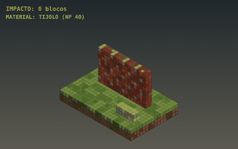
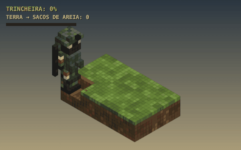
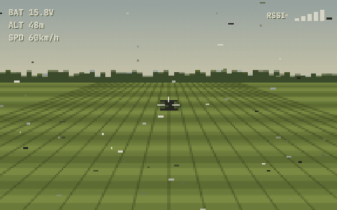
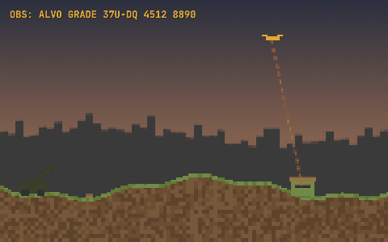
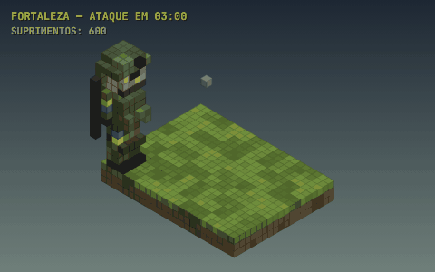
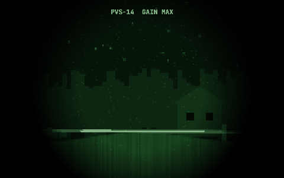

# DARKRIOT — Brainstorm

Site de brainstorm do **DARKRIOT**: um milsim tático no estilo *Arma*, inspirado no conflito UC × RU (com facções fictícias), num mundo de blocos destrutível no estilo *Minecraft*.

**Site:** https://gedehamsen021.github.io/Darkriot-Brainstorm/ (depois de ativar o GitHub Pages, veja abaixo)

| Destruição | Trincheira | FPV vs EW |
|---|---|---|
|  |  |  |
| **Artilharia** | **Fortaleza** | **Blackout** |
|  |  |  |

## O que tem no site

1. **Visão**: pilares, ficha técnica, loops de jogo
2. **Engine**: por que Godot 4, comparativo com Unity e Unreal, stack e arquitetura de rede
3. **Facções e mundo**: Coalizão Kalyna × Legião Boreal, kits, veículos e o mapa tático procedural do Oblast de Vorsk
4. **Concept arts**: geradas por um mini motor voxel isométrico escrito em JavaScript (`assets/js/voxel.js`)
5. **Modos de jogo**: Linha de Frente, Fortaleza, Blackout, Caçada de Drones, Patrulha e Campanha Dinâmica
6. **Mecânicas**: 15 sistemas com filtro por fase (MVP, Alpha, Beta, Pós)
7. **GIFs de gameplay**: 6 loops animados, também em `.gif` para baixar
8. **Cronograma**: Gantt de out/2026 até o Early Access (mar/2028), marcos, fases e as 12 primeiras semanas sprint a sprint
9. **Orquestração**: fluxo de trabalho com IA, guia do modelador (Blockbench), checklist de modelos, biblioteca de prompts, decisões e riscos

## Ativar o GitHub Pages

1. No GitHub, abra **Settings → Pages**.
2. Em **Build and deployment → Source**, escolha **Deploy from a branch**.
3. Em **Branch**, escolha a branch com o site (por exemplo `main` depois do merge, ou `claude/gifted-tesla-28e5uq`) e a pasta **/ (root)**. Clique em **Save**.
4. Em 1–2 minutos o site sai em `https://gedehamsen021.github.io/Darkriot-Brainstorm/`.

O site é estático (HTML, CSS e JS puros, sem etapa de build). O arquivo `.nojekyll` faz o Pages servir tudo como está.

## Ver localmente

Abra o `index.html` no navegador, ou sirva a pasta:

```bash
python3 -m http.server 8000
# http://localhost:8000
```

## Estrutura

```
index.html              página única com todas as seções
assets/css/style.css    visual (tema escuro militar, fonte pixel Silkscreen)
assets/js/main.js       dados do brainstorm (modos, mecânicas, cronograma, prompts…) e montagem da página
assets/img/             concept arts, hero, mapa e animações (.webp) pré-renderizados
assets/gifs/            as animações em .gif, para baixar
assets/js/voxel.js      mini motor voxel isométrico (canvas 2D)
assets/js/models.js     modelos voxel: soldados, tanque, IFV, drone, casa, girassol…
assets/js/art.js        concept arts + mapa tático procedural
assets/js/anims.js      animações de gameplay (funções puras do tempo → loops perfeitos)
tools/render/           exporta as artes e animações do código para assets/img e assets/gifs
```

Para mudar o conteúdo (cronograma, mecânicas, prompts, checklist), edite os arrays no topo de `assets/js/main.js`.

As artes e animações são **geradas pelo código** de `voxel.js`, `models.js`, `art.js` e `anims.js`, mas a página mostra as **imagens já exportadas** — desenhar tudo ao vivo no navegador travava a rolagem, principalmente no celular.

## Regenerar as artes e animações

Depois de editar `assets/js/art.js`, `models.js` ou `anims.js`:

```bash
npm i playwright            # uma vez
pip install pillow          # uma vez
node tools/render/export.js           # tudo (ou só uma parte: node tools/render/export.js arts map anims)
python3 tools/render/encode.py        # gera assets/img/*.webp e assets/gifs/*.gif
```
